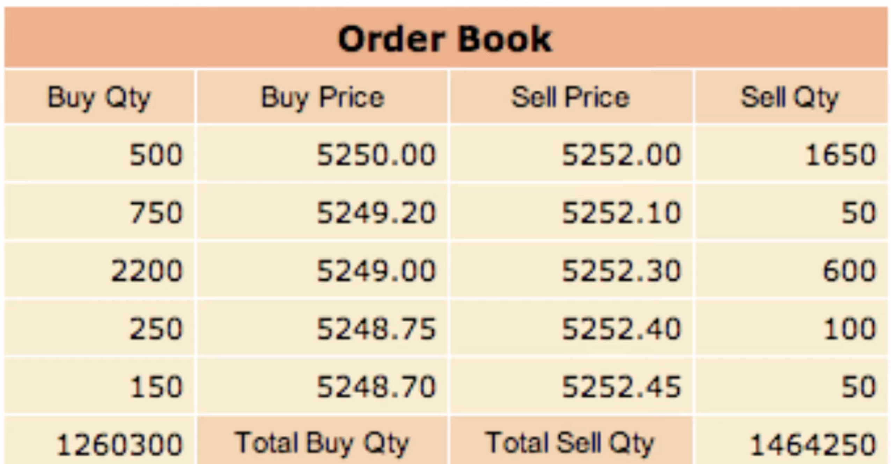
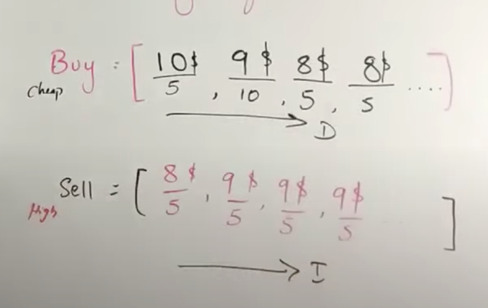
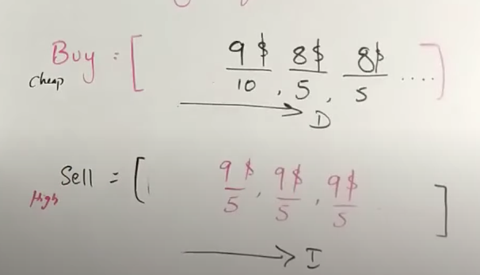
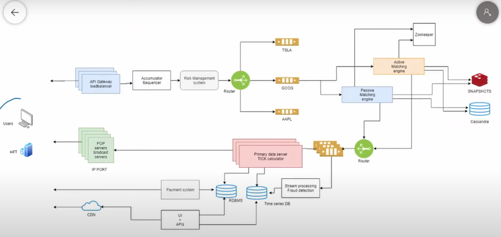

# Requirement
- Buy and sell stocks
- Realtime sotck price update
- Order history
- Risk management
# Goals
- 0.1 million order/sec
- 5k stocks
- Geo specific
- Low latency
- Highly available system
# Matching Engine
- Place to show matching on selling and bying
 
 
- Should able to add order
- Cancel order
- Split order
- Match order
- Goal to do in O(1) or O(logn)
## Design
- Buy queue
    - Buyer at high price should come first
- Sell queue 
    - Sell at low price should come first
How to match?
    - Match index of both array one by one

    
    - Compare first order

    
    - Use priority queue to manage buy and sell stocks
- Since we want to perform matching algo, efficient, we would like to perform these operatio in memory
- Keep these data stored in db only to reload it in memory
- Treat whole thing as state machine
# Overall System Design
- Assign unique identification number to each order
- Manage separate queue for each company
- On high traffic, there will be separate worker to process each queue
- On low traffic, a worker can process multiple queue
- At any given point of time, we need two maching engine for high availabilty and reliability
    - Active matching engine
    - Passive matching engine
- Both active and passive matching engine receives message
- Only active matching engine will write data
- Zookeepr takes care of deciding active/passive nodes
- Tick calculator
    - To know if price is up or low
- Write data into time series database to draw graph on price 
- Stream processor is used to detect the fraud etc
- Cached time series data

# Alternate System Design
- Use pipeline structure
- Use RabbitMQ/Kafka to store messages
- Design event gateway to route messages
- Have dedicated worker to process data from message
